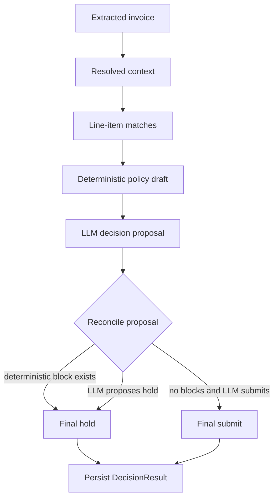

# feat: Add LLM submit-versus-hold decisioning

## Summary

Add an LLM-backed submit-versus-hold decision stage after extraction, entity resolution, and line-item matching. The model should propose the decision and reviewer-facing rationale from the validated signals, while deterministic policy remains the safety envelope that prevents unsafe auto-submission.

---

## Problem Frame

`PRD-CHECKLIST.md` leaves one AI-first workflow item open: submit-versus-hold decisioning is still deterministic over AI-derived extraction and matching signals. `PRD.md` asks for LLM integration across extraction, metadata/entity resolution, line-item matching, and submit-versus-hold decisioning, so the current pipeline is strong but not implemented as written.

The work should preserve the architecture's typed trust boundary and transparent review surface. The LLM can judge and explain, but it cannot turn known blocking exceptions into an auto-submit without deterministic validation.

---

## Requirements

- R1. The decision stage calls the LLM with extracted metadata, resolved context, match statuses, price deltas, total checks, and deterministic exception candidates.
- R2. The LLM returns a typed decision proposal with `submit` or `hold`, rationale, exception references, confidence, and any warning observations needed for reviewer display.
- R3. The persisted `DecisionResult` remains valid against the shared Zod contract and keeps reviewer-facing rationale and exceptions understandable.
- R4. Deterministic policy remains a submit safety guardrail: any deterministic blocking exception forces the final persisted decision to `hold`, even if the LLM proposes `submit`.
- R5. The pipeline, QC metadata correction, QC match correction, demo seeding, offline eval, and live eval all use the same decision orchestration path.
- R6. The system remains usable without networked LLM calls for offline tests and demo seeding through recorded decision proposals or a deterministic fallback path.
- R7. Tests prove clean submit, deterministic-block override, LLM-hold-without-blocker, warning-only total mismatch, malformed proposal handling, and recorded-fixture parity.
- R8. The checklist and architecture docs accurately describe LLM-assisted decisioning once the behavior ships.

---

## Key Technical Decisions

- KTD1. Add a decision proposal schema instead of widening `DecisionResult` first. `DecisionResult` is the persisted UI/API contract, while a separate `DecisionProposal` represents untrusted model output before validation.
- KTD2. Keep `server/src/decide.ts` as the deterministic policy builder and add a reconciliation layer around it. This preserves existing exception semantics and makes the LLM's role auditable.
- KTD3. Let deterministic blocks override model submits, but allow model holds when no deterministic block exists. This satisfies LLM decisioning while keeping auto-submit conservative.
- KTD4. Store final reviewer-facing rationale in the existing `DecisionResult.rationale` field. Add proposal metadata only if needed for debugging or tests; avoid broad UI changes unless the contract genuinely needs it.
- KTD5. Reuse the existing Anthropic JSON parsing pattern in `server/src/llm.ts`. The decision call should share refusal, truncation, transient error, and schema-validation behavior with extraction, resolution, and matching.
- KTD6. Prefer recorded decision proposals in fixtures over live LLM calls in offline verification. This keeps `npm test` and `npm run verify` deterministic and cost-free.

---

## High-Level Technical Design

The deterministic policy draft should produce the canonical exception list from current validated signals. The LLM receives that draft plus the source signals and proposes the business decision and explanation. Reconciliation validates the proposal, preserves deterministic warnings and blocks, and decides the final persisted `DecisionResult`.

---

## Scope Boundaries

### In Scope

- Add LLM decision proposal generation and validation.
- Reconcile model proposals with deterministic policy.
- Route all existing decision paths through the same orchestrator.
- Update recorded fixtures and evals for offline and live coverage.
- Update checklist and architecture documentation for the shipped behavior.

### Deferred to Follow-Up Work

- A real ClinRun/backend submission endpoint remains out of scope because `PRD-CHECKLIST.md` still marks that destination unclear.
- Standalone AI usage documentation remains separate from this plan unless the implementation touches decisioning docs naturally.
- UI redesign for decision display is out of scope unless a contract addition requires a small display change.

---

## System-Wide Impact

This change affects the shared contract, server LLM boundary, pipeline orchestration, fixture format, evals, demo seed data, and reviewer-visible decision rationale. The most important invariant is that all persisted records still parse through `InvoiceRecord` and all browser API responses remain contract-shaped.

---

## Implementation Units

### U1. Model and Contract the Decision Proposal

- **Goal:** Define the untrusted LLM decision output shape and any optional final-decision metadata needed by downstream code.
- **Requirements:** R1, R2, R3, R4.
- **Dependencies:** None.
- **Files:** `shared/src/index.ts`, `server/test/decide.test.ts`.
- **Approach:** Add a `DecisionProposal` schema near the existing decision contract. Keep it separate from `DecisionResult`; only extend `DecisionResult` if the implementation needs durable proposal confidence or source attribution. If `DecisionResult` changes, update `InvoiceRecord` parsing through the existing shared contract.
- **Patterns to follow:** `EntityResolutionProposal` and `MatchProposal` in `shared/src/index.ts`.
- **Test scenarios:** Parse a valid proposal containing `decision`, `rationale`, exception references or observations, and confidence. Reject invalid decisions, non-numeric confidence, and malformed exception references. Confirm existing `DecisionResult` fixtures still parse unchanged if the final contract is not widened.
- **Verification:** The shared contract cleanly distinguishes untrusted proposal data from persisted decision results.

### U2. Add the LLM Decision Call

- **Goal:** Add a model call that proposes submit-versus-hold from validated pipeline signals and deterministic policy context.
- **Requirements:** R1, R2, R6.
- **Dependencies:** U1.
- **Files:** `server/src/llm.ts`, `server/test/decide.test.ts`.
- **Approach:** Add a decision-specific system prompt and exported function in `server/src/llm.ts`. Prompt the model to use the deterministic exception candidates, match reasons, confidence values, price deltas, protocol status, and invoice total signals. Require JSON only and parse through `DecisionProposal`.
- **Patterns to follow:** `resolveEntities`, `proposeMatches`, `guardText`, and `parseJson` in `server/src/llm.ts`.
- **Test scenarios:** Given representative extracted/resolved/match/draft inputs, the prompt payload includes all decision-critical signals. A valid JSON response parses into `DecisionProposal`. Refusal, truncation, empty text, transient API failures, and invalid JSON behave consistently with existing LLM calls.
- **Verification:** The decision call exposes a typed proposal function without changing pipeline behavior until reconciliation is wired.

### U3. Reconcile LLM Proposals with Deterministic Policy

- **Goal:** Produce the final `DecisionResult` by combining the deterministic policy draft and the LLM proposal under conservative auto-submit rules.
- **Requirements:** R3, R4, R7.
- **Dependencies:** U1.
- **Files:** `server/src/decide.ts`, `server/test/decide.test.ts`.
- **Approach:** Split current deterministic behavior into a reusable policy draft builder if needed, then add a reconciliation function that accepts the draft and optional proposal. Deterministic blocking exceptions force final `hold`; deterministic warnings are retained; a model `hold` can add or emphasize rationale when no deterministic block exists; a model `submit` is accepted only when no deterministic block exists.
- **Patterns to follow:** Current exception construction and rationale style in `server/src/decide.ts`.
- **Test scenarios:** Clean invoice plus LLM `submit` returns submit with model-informed rationale. Price mismatch plus LLM `submit` returns hold and retains `price_mismatch`. Unmatched line plus LLM `submit` returns hold and retains `unmatched_line_items`. No deterministic block plus LLM `hold` returns hold with a reviewer-understandable rationale. Total mismatch warning plus LLM `submit` returns submit and retains `total_mismatch` as `warn`. Malformed or absent proposal falls back to deterministic result.
- **Verification:** Auto-submit is impossible when deterministic policy found a blocking exception, and all final results remain `DecisionResult` shaped.

### U4. Wire Decision Orchestration Through Pipeline and QC Paths

- **Goal:** Replace direct deterministic `decide(...)` calls with one decision orchestration path that can call the LLM and fall back safely.
- **Requirements:** R1, R4, R5, R6.
- **Dependencies:** U2, U3.
- **Files:** `server/src/pipeline.ts`, `server/src/decide.ts`, `server/src/llm.ts`, `server/test/decide.test.ts`.
- **Approach:** Add a server-side decision helper that builds the deterministic draft, requests the LLM proposal, reconciles the result, and handles transient or invalid proposal failures. Use it in `runPipeline`, `correctMetadata`, and `correctMatch`. Preserve existing stage transitions and `submitted_by` behavior.
- **Patterns to follow:** `matchAgainstCatalog` orchestration in `server/src/pipeline.ts` and entity-resolution fallback behavior in `runPipeline`.
- **Test scenarios:** Initial pipeline decision uses the LLM proposal path when configured. Metadata correction re-runs matching and LLM-assisted decisioning. Match correction re-runs LLM-assisted decisioning. LLM busy or invalid proposal leaves a safe deterministic final decision and does not discard saved human corrections. `submitted_by` remains `ai` only when final decision is submit.
- **Verification:** Every production decision path goes through the same LLM-aware helper, and failure modes preserve current conservative behavior.

### U5. Update Fixtures, Demo Seed, and Evals

- **Goal:** Keep non-networked verification and demo data representative of the new LLM decision stage.
- **Requirements:** R5, R6, R7.
- **Dependencies:** U3, U4.
- **Files:** `fixtures/recorded.json`, `fixtures/golden.json`, `server/test/eval-smoke.test.ts`, `eval/run.ts`, `scripts/seed-demo.ts`.
- **Approach:** Add recorded decision proposals for each fixture and thread them through offline eval and demo seeding. Update live eval to call the new LLM decision function after matching. Keep golden expected final decisions and exception codes as the oracle.
- **Patterns to follow:** Existing recorded extraction, entity-resolution, and match proposal usage in `server/test/eval-smoke.test.ts` and `scripts/seed-demo.ts`.
- **Test scenarios:** Offline eval consumes recorded decision proposals and still matches every golden decision. Demo seed records final submitted/held status using the same reconciliation logic as production. Live eval grades final decision and exceptions after a real decision proposal call. Missing recorded decision proposal falls back safely or fails with a clear fixture error, depending on the chosen fixture policy.
- **Verification:** Fixture-driven tests prove the new stage without network access, while live eval covers real end-to-end LLM decisioning on demand.

### U6. Refresh Documentation and Checklist

- **Goal:** Make project docs accurately describe LLM-assisted submit-versus-hold decisioning.
- **Requirements:** R8.
- **Dependencies:** U1, U2, U3, U4, U5.
- **Files:** `ARCHITECTURE.md`, `PRD-CHECKLIST.md`, `shared/src/index.ts`, `server/src/decide.ts`, `server/src/llm.ts`.
- **Approach:** Update architecture language from deterministic decisioning to LLM proposal plus deterministic reconciliation. Mark the PRD checklist item complete only after code and tests are in place. Adjust comments near decision contracts and modules so future readers see the new responsibility split.
- **Patterns to follow:** Existing architecture bullets and checklist completion notes.
- **Test scenarios:** Test expectation: none -- this unit is documentation and comment alignment after behavior is already covered in U1-U5.
- **Verification:** Documentation no longer claims decisioning is deterministic-only, and the checklist item explains how the LLM decision is validated.

---

## Risks & Dependencies

- **Risk:** The LLM may produce persuasive rationale that conflicts with deterministic exceptions. **Mitigation:** Reconciliation keeps deterministic blocks authoritative and retains canonical exception codes.
- **Risk:** Adding another live model call increases latency and transient failures. **Mitigation:** Reuse existing retry/busy handling and fall back to deterministic decisioning when needed.
- **Risk:** Fixture drift could make offline eval less meaningful. **Mitigation:** Record decision proposals alongside existing LLM outputs and keep `fixtures/golden.json` as the final-outcome oracle.
- **Dependency:** The implementation depends on the current Anthropic client and `config.model` used by existing LLM stages.

---

## Acceptance Examples

- AE1. Given a clean invoice with resolved metadata and matched line items, when the LLM proposes `submit`, then the final record is `submitted` with `submitted_by: "ai"` and a reviewer-readable rationale.
- AE2. Given a price mismatch, when the LLM proposes `submit`, then the final record is `held` and includes a blocking `price_mismatch` exception.
- AE3. Given no deterministic blocking exceptions, when the LLM proposes `hold` for a clearly explained ambiguity, then the final record is `held` and the rationale explains the model's concern.
- AE4. Given a warning-only total mismatch, when the LLM proposes `submit`, then the final record is `submitted` and retains the `total_mismatch` warning.
- AE5. Given an invalid or unavailable LLM decision proposal, when decisioning runs, then the system returns the deterministic result rather than failing the whole invoice.

---

## Sources & Research

- `PRD-CHECKLIST.md` identifies LLM submit-versus-hold decisioning as the immediate open item.
- `PRD.md` requires LLM integration for extraction, metadata/entity resolution, line-item matching, and submit-versus-hold decisioning.
- `ARCHITECTURE.md` currently documents deterministic decisioning over AI-derived signals, which this plan changes to LLM proposal plus deterministic reconciliation.
- `shared/src/index.ts` owns the Zod trust boundary for LLM proposals and persisted invoice records.
- `server/src/llm.ts` centralizes Anthropic calls, JSON recovery, refusal/truncation handling, and transient failure translation.
- `server/src/decide.ts` owns current exception generation and deterministic submit/hold policy.
- `server/src/pipeline.ts`, `scripts/seed-demo.ts`, `server/test/eval-smoke.test.ts`, and `eval/run.ts` are the decision orchestration call sites that must stay aligned.
